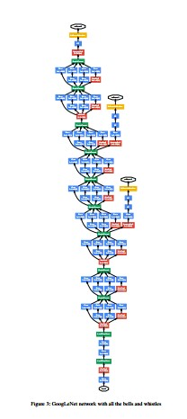

# GoogLeNet

## Inceptionv1

Paper Site: https://arxiv.org/abs/1409.4842

Source Code: https://github.com/tensorflow/models/blob/master/research/slim/README.md(nets)

### Inceptionv1 Module Architecture

1. 为了使用稀疏结构来代替稠密结构的卷积网络而设计出来的架构。
2. 在普通版本(a)上进行了多卷积核大小的卷积，从而提取到不同感受野的不同尺度特征。
3. 在第二个版本(b)中为了使得参数量降低，而设计了1X1卷积核来降低输出通道，从而达到降低参数量的作用。
4. 注意一点这些不同卷积核通过的padding以后，输出的特征图大小都一样。

## Network Architecture

1. 可以从图中看出网络结构就是使用上述的模块图拼接而形成的。
2. 为了防止梯度弥散，在中间层加入了loss函数，这块具体实现使用了衰减系数。
3. 总体结构相当直观，实验机巧很重要。毕竟这是2014年的文章了，有点老了。

Author: Milittle

Blog Website: www.weaf.top

QQ：329804334

Mail：milittle@stu.xjtu.edu.cn

贡献：添加qq好友，联系我。

备注：文档中所有图表均来自文章。
