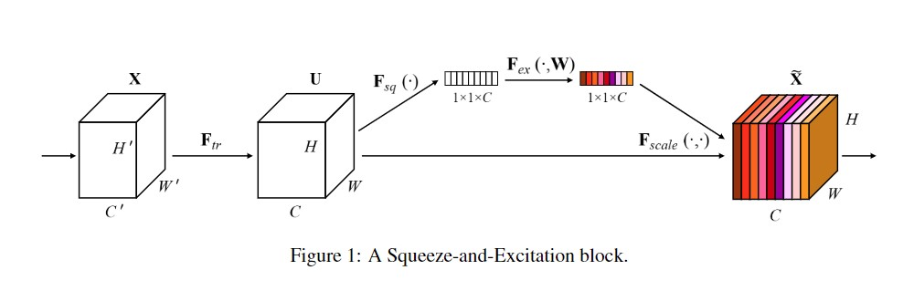
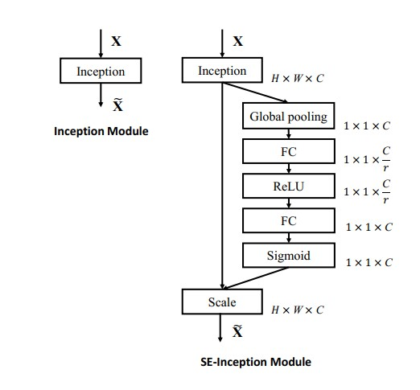
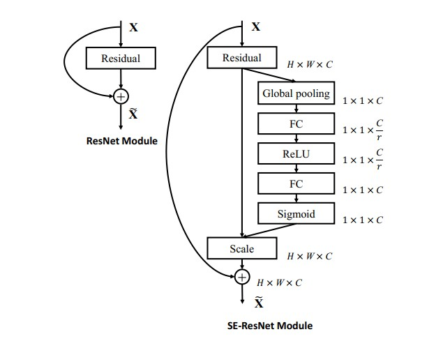
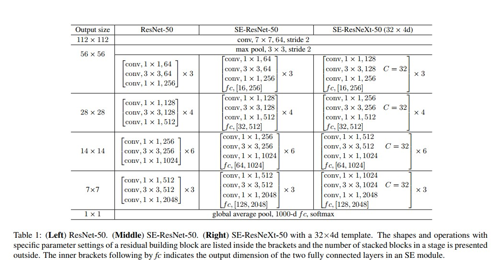

# SENet：Squeeze-and-Excitation Networks

CVPR 2018：http://openaccess.thecvf.com/content_cvpr_2018/papers/Hu_Squeeze-and-Excitation_Networks_CVPR_2018_paper.pdf

此文章获得了ILSVRC 2017分类比赛第一名。

Source Code： https://github.com/hujie-frank/SENet （caffe）

https://github.com/taki0112/SENet-Tensorflow （TensorFlow）

## Squeeze-and-Excitation Block

1. 从上图可以看出F_tr是通过一些卷积然后得到输入的特征变换。
2. 再经过F_sq这个分支进行squeeze操作，也就是这个block的前一个单词squeeze。可以通过global average pool或者global max pool来实现。
3. 再经过F_ex就是Excitation操作，其实这个过程就是全连接，然后生成一个自注意力的权重。
4. 最后将得到的scale乘在原来得到的那个特征图上，这个通道是一直的，其实这个过程就是做了一个通道级的特征筛选，作者很巧妙呀。

## 接下来我们看一下，将这个SE模块加入到普通的Inception和ResNet这些模块中是如何体现的

1. 可以从上图中作图看出，普通的inception模块是那样组织的。
2. 右边的图是加入SE模块以后的图首先从Inception的输出得到一个特征图，也就是我们刚才经过F_tr的过程，然后通过Global pooling操作，将空间的特征点感受野就是原特征图大小，然后保留通道数一致。经过FC降维，经过Relu，为了增加网络的非线性能力，然后再经过FC来提升通道至输入通道。这个整体的过程其实就是先通过Global pooling进行文章中的squeeze操作，然后通过全连接层+sigmoid实现Excitation操作，最后将这些权重直接按照通道乘在原来从Inception出来的特征图，这个过程有点像注意力模型，只不过是对于不同通道的重要度的选择。（笔者这里有一个小小的想法，就是可以通过将Excitation出来的权重向量，加一个l1正则化约束，然后将这个正则化约束加入到loss中一起训练，那么这样可以后期将不重要的通道进行剪枝操作，以便让网络模型大小更小，然后再通过fine-tune来达到原始性能。这点参考来自于发表在ICCV 2017上的一篇文章， Net-slimming，只不过那个文章是在BN层中将alpha参数加入了l1正则化约束，然后训练的时候，将通道维度的不重要的卷积核去掉。）
3. 这个思想比较简单，但是很厉害，能把这个模块泛化到任意的神经网络中。

1. 左边是ResNet的基本模块结构。
2. 右边是加入SE模块以后的网络结构，其实这个结构和上述的Inception结构如出一辙，因为Residual模块为了避免网络梯度消失加入了从X输入到输出的直接相加。所以这里需要注意的是，再Scale后将原X输入加入，别再Scale之前相加。（笔者这里认为，对低层网络的输入还是保留越多越好，在网络高层中可以适当将X输入也做一个Scale，说不定这样的效果更好。这个是从一些文章里面讨来的经验，就是在模型剪枝的网络中，大家一般不会对底层网络过度剪枝，而是选择在高层时候会做高比例剪枝）。

### 小插曲

1. 在对这么多网络结构的了解下，我得到一个结论：就是所有设计卷积神经网络的作者，都围绕着，通道和空间信息的方向去改进模型结构，或者加入一些模块，来让这两方面的特征能更好的表达，你像MobileNet v1中是通过depth-wise point-wise卷积替换了传统的卷积方式，从而能减少将近卷积核大小的平方的计算量。而且后续的Xception也在Inception的基础上借助depth-wise卷积来改进网络结构。从而提升网络性能。
2. ShuffleNet是通过shuffle channel的方式来利用通道之间的信息。
3. 这些方式，想办法在通道空间不同卷积下，可以在每个过程中加入一些自注意力机制，或者直接全连接方式加入注意力机制。或者在中间的过程加入Relu激活来增强网络的非线性能力。（上次不知道在哪里看到如果网络够宽，那么就相当于是非线性网络，这个还没来得及看，等有机会了，看一下）。

### 下面给出一些网络结构表

### 总结

以上所述，其实讲了很多自己的一些见解，但是都是未经过实验检验的，如果有不同意见，或者有想讨论的，可以加我qq我们可以一起讨论哦。

Author: Milittle

Blog Website: www.weaf.top

QQ：329804334

Mail：milittle@stu.xjtu.edu.cn

贡献：添加qq好友，联系我。

备注：文档中所有图表均来自文章。