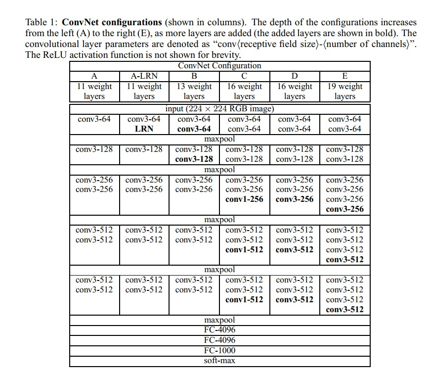

## VGG

VGG可谓是很强势的网络，你看看现在应用很广泛，但是在一些边缘设备上，并没有应用广泛，就是由于模型太大了。google搜索被引用了20671次。

Paper site ：<https://arxiv.org/abs/1409.1556>

Source Code： <https://github.com/machrisaa/tensorflow-vgg> （TensorFlow）

## 这比较早了，给你一张表，感受一下，vgg又深又深，参数量耿直了。

1. 感受一下，很深的网络，而且基本都是3X3的卷积核，参数量多的一批。
2. 一般现在我们用的网络结构都是vgg-16和vgg19。
3. 我一般在考虑怎么将性能好的，速度快的模型，参数量少的模型应用在实际的应用场景下，但是这个，太慢了。（倒是可以使用剪枝的方式，将vgg进行剪枝，感觉vgg的网络参数过于冗余，有时候遇见剪枝网络，就是在vgg上做，而且一般剪完，fine-tune以后，性能不掉，还能上涨一丢丢）

## 没啥好总结的。就是卷积一把刷。（经典的网络一般都不需要过多的解释）

Author: Milittle

Blog Website: www.weaf.top

QQ：329804334

Mail：milittle@stu.xjtu.edu.cn

贡献：添加qq好友，联系我。

备注：文档中所有图表均来自文章。