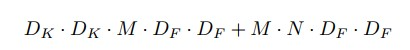

## MobileNet V1

Paper Site：[Site](https://arxiv.org/abs/1704.04861)

Source Code Github and Pre-train model:  [Github](https://github.com/tensorflow/models/blob/master/research/slim/nets/mobilenet_v1.md)

## MobileNet V1 Architecture

1. MobileNet就是为了在手机端运行深度卷积网络而设计的网络结构。
2. 总体结构和普通CNN没有区别，最大的区别就是卷积方式的改变。
3. 我们可以从上图看出（a）标准的卷积方式是直接进行N个通道的卷积。
4. 而（b）图就是此篇文章中的卷积方式，首先N个channel分别卷积，不进行通道融合（这是和普通卷积不同的地方）。
5. 然后再通过1X1卷积进行通道融合。这个过程会节省好多Multi操作，也减少了参数量。
6. 上述的卷积方式就叫做深度分离卷积，也就是传统的卷积方式上不将通道进行融合。

### Standard Conv formula：

Dk代表输入图像的大小，M是输入图像的通道数，N是输出特征图的通道数，DF是卷积核大小

### Depth-Wise Conv formula：

从公式中你看到了什么？，首先将M个输入通道分别卷积不联合，随后通过1X1卷积进行融合，当然你也可以通过其他大小的卷积核进行通道级别的融合。

### Save Multi 节省的算子量

## Width Multiplier: Thinner Model

1. MobileNet中加入了两个参数来限制模型的复杂度，这是其中一个限制卷积过程通道数的参数alpha。
2. 加入alpha参数的深度可分离卷积变为如下公式：

## Resolution Multiplier: Reduced Representation 

1. 这是第二个参数限制模型的表达能力，直接从原图上采取不同尺寸的图像大小。
2. 下面是加入了宽度和分别率限制参数的深度可分离卷积。

从上面的公式中，我们可以得出要给结论，就是MobileNet本质就是将卷积分为两个阶段，一个是每个通道空间域的信息融合，以及最后逐通道的信息联合，前者过程就是深度可分离卷积，后者就是我们普通的卷积，只不过是一般采用1X1卷积方式。

## MobileNet Body Architecture Table

Author: Milittle

Blog Website: www.weaf.top

QQ：329804334

Mail：milittle@stu.xjtu.edu.cn

贡献：添加qq好友，联系我。

备注：文档中所有图表均来自文章。
