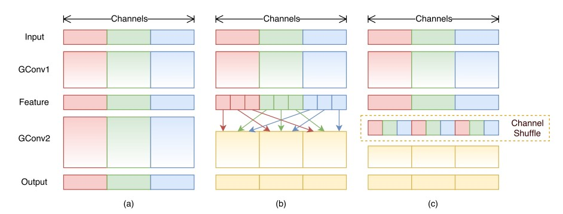
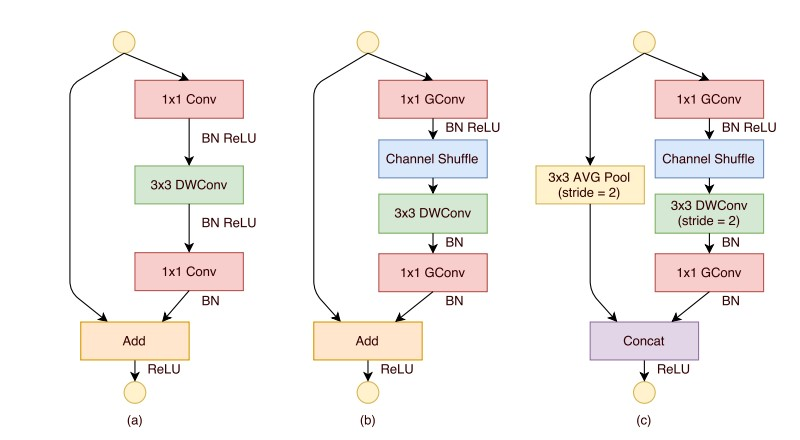
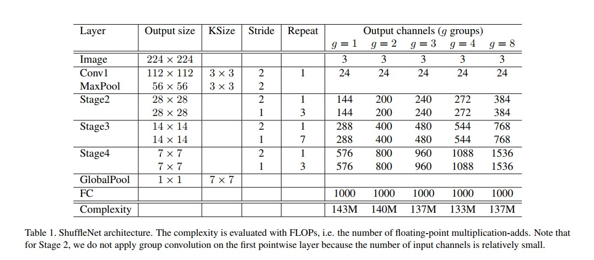

## ShuffleNet

Paper site: [Site](https://arxiv.org/abs/1707.01083)

Source code in Github: [Github](https://github.com/MG2033/ShuffleNet)

## ShuffleNet Architecture

1. 从上图可以看出，ShuffleNet的网络结构是在组卷积的基础上，进行了channel shuffle的操作，将通道信息打乱。
2. 普通的组卷积方式，是通过(a)的方式来进行组卷积的。
3. (b)的方式是将每个组中的一部分均匀分布在后续的组卷积中。
4. (c)的方式直接通过channel shuffle的方式将通道打乱。

## ShuffleNet Unit

1. (a)的方式将对输入进行1x1卷积，然后再通过3X3深度可分离卷积（可以看MobileNet部分得知深度可分离卷积），然后再经过1X1卷积，这里还借鉴了ResNet的思想，将输入和输入直接进行Add得到最终的输出feature map.
2. (b)的方式将(a)中1X1的卷积核换成了组卷积，然后在第一个组卷积后加入了Channel Shuffle的操作。其他操作不变，这里也说明了一个问题，**那就是ShuffleNet的思想，只能使用到组卷积当中**。
3. (c)的方式在旁路中加入了一个3X3均值pool，（stride是2）这样就会将分辨率降到原来的1/2。所以最后使用了concat操作。
4. 需要注意的是里面的BN是Batch Normalization操作，Relu是激活函数。

## ShuffleNet Architecture Table

QQ:329804334

Website: www.weaf.top

Mail:mizeshuang@gmail.com

备注：文档中所有图均来自论文