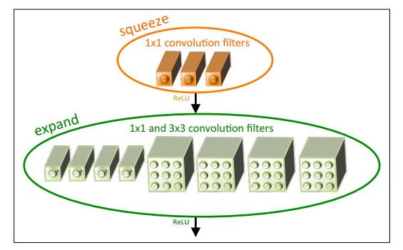
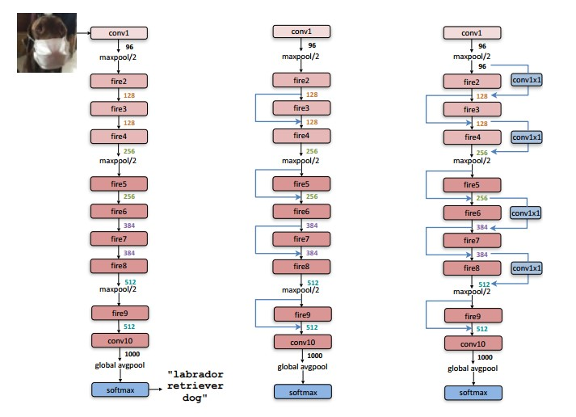
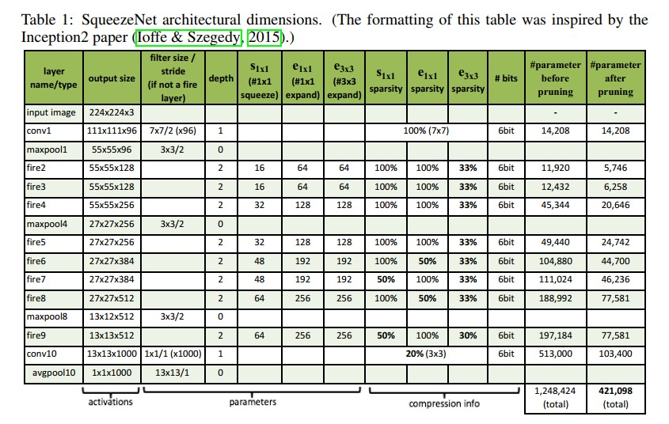

## SqueezeNet

Paper Site: [ICIR 2017](https://arxiv.org/abs/1602.07360)

Source Code Github: [Github](https://github.com/DeepScale/SqueezeNet)

DownLoad From This Repo: [Paper PDF](https://github.com/Milittle/awesome-dl-network/blob/master/paper/1602.07360_SQUEEZENET%20ALEXNET-LEVEL%20ACCURACY%20WITH%2050X%20FEWER%20PARAMETERS%20AND%200.5MB%20MODEL%20SIZE.pdf)

CNN Architectural Design Strategies:

**Strategy 1:** Replace 3 X 3 filters with 1 X 1 filters.

替换3 X 3卷积核大小到1 X 1大小。

**Strategy 2:** Decrease the number of input channels to 3 X 3 filters.

在使用3 X 3大小的卷积核中，减小输入通道。

**Strategy 3:** Downsample late in the network so that convolution layers have activation maps.

在激活特征图上实现下采样。通常的做法有pool层，还有在卷积层加入stride>1的配置。

### Fire Module

在以上的Fire Module中，有一个squeeze层核expand层。squeeze层只有1X1卷积核。（使用到了strategy1）expand层有1X1卷积核和3X3卷积核。文章中指出该Fire Module有三个超参配置分别为：
: 所有squeeze层的卷积核个数

: 所有expand层1X1的卷积核个数

: 所有expand层3X3的卷积核个数

设定小于,这就是strategy2。

### SqueezeNet Architecture

1. 以上是SqueezeNet网络结构，第1层普通卷积层，2-9都是上述提到的Fire Module，第10层也是一个普通的卷积层。
2. 在卷积层1、模块4、模块8、加入maxpool，步长为2。
3. 在卷积层10加入global AvgPool。

### 网络整个架构维度表

### 实现细节

1. 1X1和3X3卷积核输出的feature map大小一致，因为在3X3中加入了padding。
2. 在squeeze层和expand层都加入了Relu激活函数。
3. 在Fire9后面加入了Dropout层，丢弃概率为0.5。
4. squeezeNet没有全连接层。
5. 初始学习率设置为0.04。在训练的过程中逐渐减小学习率。

QQ: 329804334

Mail：milittle@stu.xjtu.edu.cn

备注： 文档中图都来自原论文。

