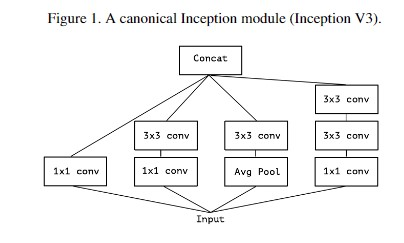
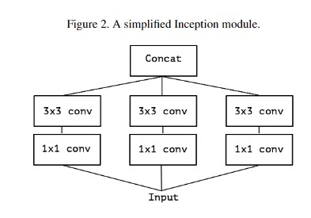
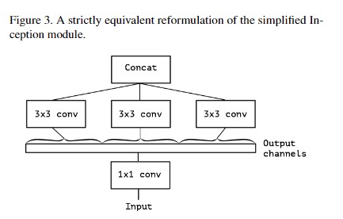
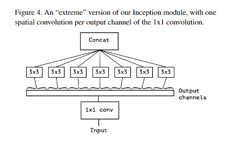
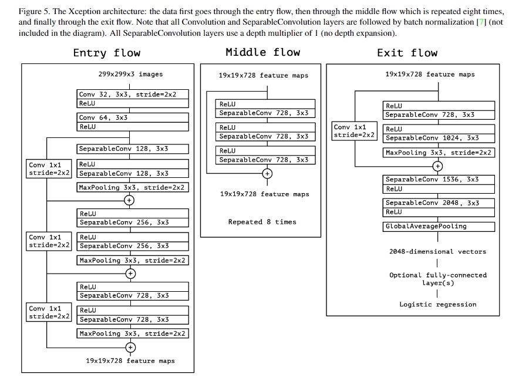

## Xception

Paper site:  https://arxiv.org/abs/1610.02357

Source Code Based TensorFlow:  https://github.com/kwotsin/TensorFlow-Xception

Source Code Based Caffe:  https://github.com/yihui-he/Xception-caffe

Source Code Based PyTorch: https://github.com/jfzhang95/pytorch-deeplab-xception

### 首先明确一点，那就是Xception不是真正意义上的轻网络，因为它只不过采用了轻网络的设计思路，是在InceptionV3上加入Depth-Wise Conv进行的改进，首先看一下InceptionV3的一个Module。

1. 我们可以从上图看出输入经过一些1X1的卷积，然后再经过3X3的卷积，最后进行concat形成特征图。
2. 然后经过设计去掉Avg pool操作，得到下面的卷积模块。

3. 可以看出上面的卷积方式，首先使用1X1卷积得到跨通道特征图，在这个过程中，可以实现channel降维或者升维。进而融合1X1卷积(其实是等价的操作，参数量并没有发生改变)，得到下面卷积模块。

4. 最后在第二层加入多个卷积核，就变成了如下所示的卷积模块, 大家观察以下，第二层的卷积方式，是不是越来越像深度可分离卷积，只不过深度可分离卷积是单个通道进行卷积，而这个模块是一组，有多个通道，但是又比普通的少，深度可分离的多。（其实这里悟出一个道理，这些融合方式，你也可以直接使用，比如你在这个基础上，加入ShuffleNet的思想，将1X1卷积核的输出通道做一个Shuffle,然后你的网络就叫Xception-ShuffleNet，看名字我都替你想好了，是不是 妥妥的发paper了/哭笑脸）。

最后得出的结论就是，这些模型里面的思想都可以直接进行变换，你可以在实验结果好了以后，当作是定理一样用。

## Xception Architecture

1. 输入流：最左边，299 X 299 X 3的输入图像，最后得到19 X 19 X 728的feature maps。
2. 中间流：中间， 19 X 19 X 728的输入特征，输出特征为19 X 19 X 728的feature maps。
3. 输出流：最后边，19 X 19 X 728的输入特征，输出特征为2048维的特征向量，最后可以接一个类别层。
4. 所有卷积层和深度可分离卷积都是跟着BN的，在这个结构中没有显示出来。

Author: Milittle

Blog Website: www.weaf.top

QQ：329804334

Mail：milittle@stu.xjtu.edu.cn

贡献：添加qq好友，联系我。

备注：文档中所有图都出自原论文
