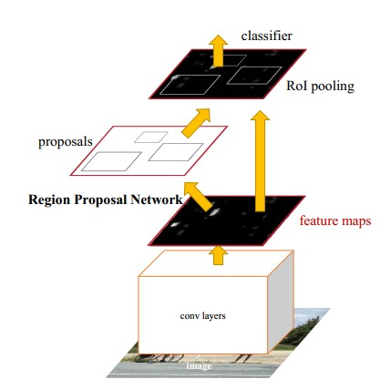
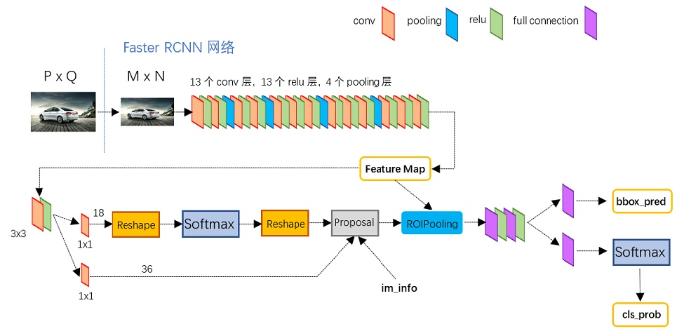
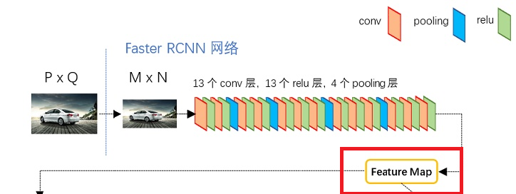

## Faster R-CNN

Paper Site: [NIPS 2015](https://arxiv.org/abs/1506.01497)

Source Code Github: [Github](https://github.com/rbgirshick/py-faster-rcnn)

Download From This Repo: [Paper PDF]()

#### Faster R-CNN 主要是将特征提取，proposal提取，bounding box regression （rect refine），classification都整合在了一个网络中，使得综合性能有了很大的提升。

基本架构图：



1. 稍微解释一下以上网络结构，Conv layers主要是对固定大小图片进行了一个特征提取，里面包括13个卷积层、13个relu层，4个pooling层。为什么说是固定大小，因为此网络输入的是一张任意图片，然后通过resize将大小固定在MxN大小，随后通过卷积层得到的特征图大小就是(M/16)* (N/16)。因为在特征提取的过程Conv层增加了padding，从而保证卷积过后的feature map是一致大小的。
2. 得到的feature map会经过Region Proposal Network。经过前景和背景以及包围框的获取，最后得到一些proposals。
3. 然后经过ROI pooling层将原来feature map在proposals中的feature map提取出来。（也就是只关心被proposals包住的feature map区域）。
4. 最后送到分类器中进行分类，并进行包围框的回归。

### 以上对Faster R-CNN的网络结构进行了简单的介绍，下面我们分开界面，主要包含以下四个方面：

1. Convolution Layers：用一种CNN网络都可以实现，基本的套路就是conv+relu+pooling提取image的feature map。该feature map被共享使用在后面的RPN和全连接分类层。（多一句嘴，这个部分可以用VGG，ResNet，DenseNet，GoogleNet，Inception等这些网络，当然你也可以利用一些轻量级的网络结构，比如MobileNet，SqueezeNet，ShuffleNet等）。所以你可以自定义。
2. Region Proposals Network。RPN网络有两个作用，一个是判断在feature map上生成的anchors是前景背景，第二个是利用bounding box regression来修正anchors，为了得到更加准确的proposals（候选区域）。
3. ROI pooling。该层的输入是feature map和proposals。综合这两者信息，用来提取proposals的feature maps。然后送到最后的全连接层进行目标类别的判别。
4. Classification。利用proposals feature maps计算proposal的类别，同时再次bounding box regression获得检测框的精确位置。

通过以上的描述，相信你已经有了一个很清楚的了解，但是对一些细节还不是特别了解，那么我将继续给你拨开迷雾。

再来看一张网络结构大图：



### 1. Convolution Layers:

* Github官方repo中是通过vgg来构建卷积特征提取网络的。
* 首先包括13个Conv，13个relu，4个pooling层。
* Conv stride 都是1，padding 都是1 kernel size 都是3。
* pooling层 stride 都是2，没有padding kernel size都是2。
* 所以根据以上描述，feature maps的宽和高只是在pooling时会减少为原来的一半。
* 这也是我们在一开始强调的feature map在最后变成了原图大小的(M/16)* (N/16)。
* 所以这里结束了卷积层提取特征图的讲解。下图是我们通过Convolution Layers得到的Feature Map。随后都是要使用到该特征图的。



### 2. RPN Network

* anchors：产生如下一组坐标：代表的是矩形左上、和右下角的坐标。

```
[[ -84.  -40.   99.   55.]
 [-176.  -88.  191.  103.]
 [-360. -184.  375.  199.]
 [ -56.  -56.   71.   71.]
 [-120. -120.  135.  135.]
 [-248. -248.  263.  263.]
 [ -36.  -80.   51.   95.]
 [ -80. -168.   95.  183.]
 [-168. -344.  183.  359.]]
```

